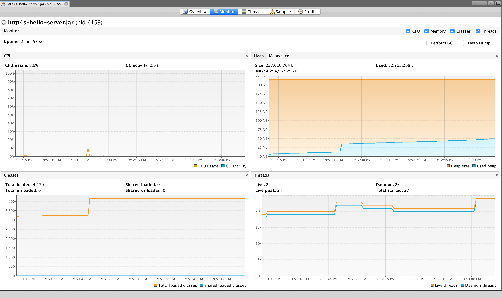

http4s REST server
------------------

```
// sbt run

java -jar target/scala-2.12/http4s-hello-server.jar
```

```bash
curl -H "correlationId: 1234" localhost:8080/api/chat/history/prayagupd
{
"correlationId":"",
"history":["hi, how can i help you?","here is coffee shop"]
}
```

```bash
curl -H "correlationId: 1234" -d '{"correlationId": "abc", "utterance": "some utterance"}' localhost:8080/api/chat
{
"correlationId":"abc",
"displayText":"Here are near by coffee shops"
}
```

TODO
----

- create separate jar for API schema

